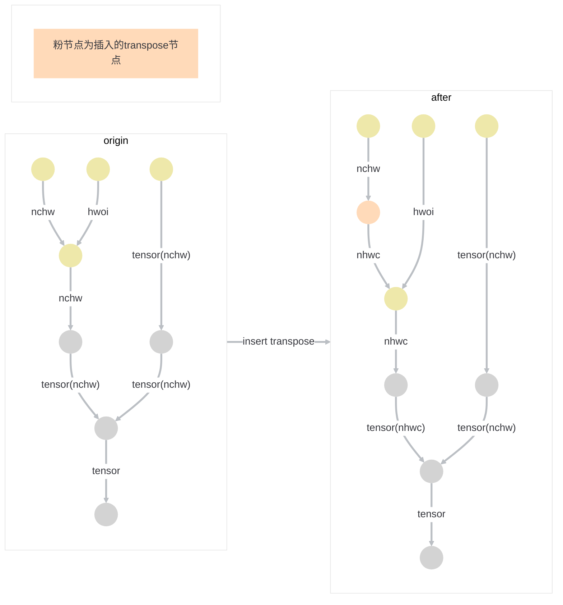
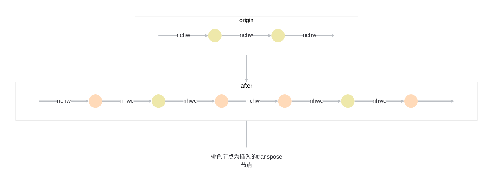
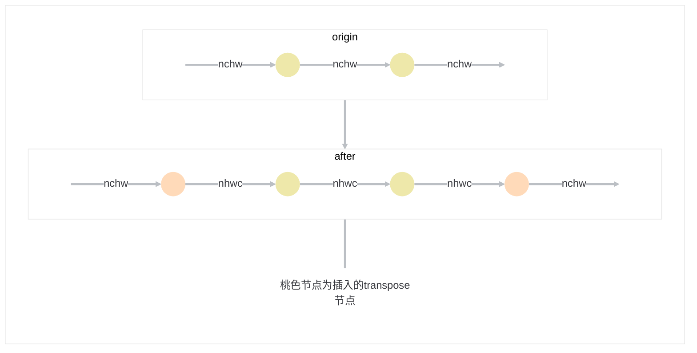
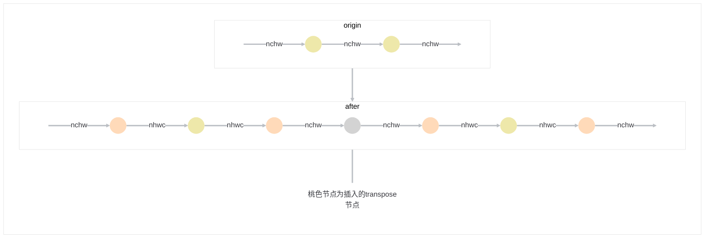
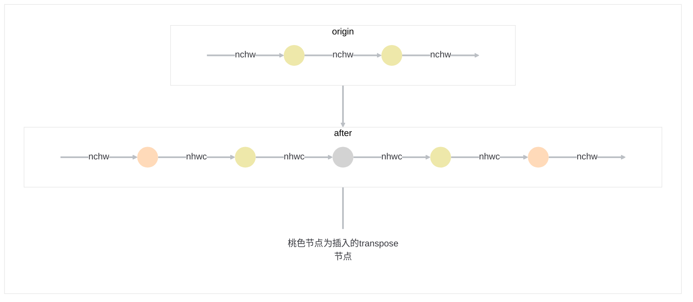
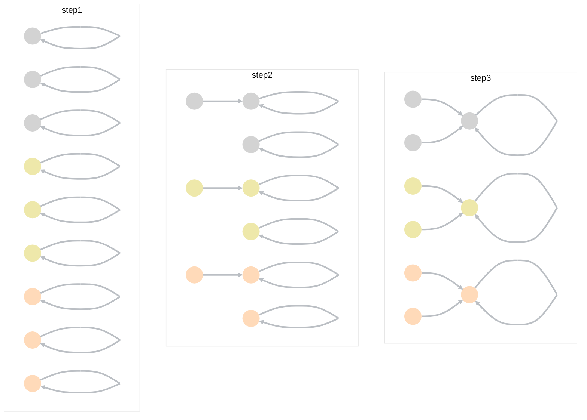

# LayoutPreset(并查集 + 连通区域)

## 原则

1. 尽可能少的插入transpose
2. 关键算子的layout需要满足条件
3. 不能改变原图的语义

## 问题描述

### layout介绍

layout大致可以分为以下三类：

- Feature类
- Weight类
- Tensor类

`Feature`类是指Conv等算子的输入，例如`NHWC`,`NCHW`等，`Weight`类是指Conv等算子的kernel输入的layout， 例如`HWOI`,`OIHW`等，Tensor类比较通用，具体又可以分为`Tensor`和`NTesnor`， 主要用于Gemm矩阵乘等算子的输入，当然不排除其它算子同时支持上述三类layout， 例如点对点类型的算子`Add， Mul， Sub`等

### layout传递

`transpose`弄够改变数据的排布方式， 并且这种影响是链式传递的

如果是`Feature`类或者`Weight`类的layout，我们可以通过算子自带的layout属性信息了解到当前算子的数据摆布情况， 通过对比算子不同时期的layout属性我们可以判断出算子的layout发生了怎样的变化，这种能够判断算子layout是否发生变化的属性至关重要，对于多输入的算子， 总是要求其输入的变化一致，否则会产生无法预知的后果，并且很难追溯问题的根源

如果是`Tensor`类的layout，其数据的排布信息无法通过算子的属性查询， 简单来说一个Tensor类的数据， 经过transpose变换后还是一个Tensor类，仅仅能从shape来判断大致经过了怎样的变化，但是当交换的维度的shape相同的时候，这两个Tensor类的数据在变换前后可以说看起来一模一样，无法区分是否经过了变换

例如， 一个`1x2x3x1`的Tensor数据经过transpose变换为了`1x3x2x1`,这里可以大致判断出其数据第1，2维发生了交换

再比如，一个`1x2x2x1`的Tensor数据交换其第1，2维，它的shape还是`1x2x2x1`， 无法区分是否经过了变换

但是，若是一个`1x2x2x1`的nchw数据交换其1，2维度， 可以通过其layout变换为nhcw推导出它的交换信息

### 单CNN类型网络Preset

单CNN类型网络指图里面的节点仅为Feature类和Weight类

单CNN类型网络的Preset流程异常简单， 仅需要在图的输入方向将layout转换为NHWC，该layout将会链式的向下传递，直到到达output节点，此时在插入transpose将NHWClayout转换为output指定的layout即可

### 多模态问题

多模态网络指`Feature`类，`Weight类`和`Tensor`类的layout共存

`Tensor`类的layout存在上述layout传递描述的问题，使得Preset的流程变得复杂，不得不考虑多种情况

这里存在以下的矛盾：

1. 算子的输入可能来自于多个分支

2. transpose的插入会引起当前分支的后续节点的layout发生变化

3. 若一个算子有多个输入，其中一个输入发生了变化，其它的输入应该也发生同样的变化
4. 数据的layout为tensor类无法推导其维度变化

以上的限制导致了我们不能随意的修改一个算子的layout，因为并不知道它的后续节点的输入是否来自于其它分支，是否做了同样的变换，有以下示例：



当插入了transpose节点后， 左边分支transpose后的节点的layout均发生了改变，但是左右分支相对独立，无法获知这一种改变，导致最后的多输入节点两边的layout不一致，又由于这个多输入节点的输入均为Tensor类，并且变换前后shape没变，此时原算子的语义已经发生了改变


## 最简单的做法

在每一个节点前后方都插入transpose， 前方节点从origin layout变为nhwc或者hwoi， 后方节点从nhwc或者hwoi变为origin 输出layout

该做法只针对于节点自身的layout需求插入transpose， 前后方的transpose起到了隔离效果，不会影响到其它的节点，所以不会改变原图的语义



但是该做法会插入2n个transpose，使得算法的总量剧增，即使后面的pass会去做冗余消除也是一个巨大的工作量，甚至有一些拓扑距离较远的transpose并不是很好消除

### 分析

#### 优点

1. 算子独立处理，能够保证图的整体语义不发生改变

#### 缺点

1. 会插入巨量的transpose，性能极差

## 进阶做法

以上有做过单CNN类型网络Preset流程的概述，仅需在单CNN类型网络的输入和输出点进行transpose的插入即可

针对于一个大的多模态网络，总是可以将网络进行拆分为若干个子网，这里假设划定子网的条件是`具有同一类型`的layout，并且将划分之后的子网看作一个`单独`的节点，对该单独的节点采用头尾插入transpose的方法即可完成layout的Preset， 并且，头尾的transpose隔离了这个`单独`的节点， 不会对前后的`单独`的节点造成影响

以下case由于中间的两个节点均为Feature类的节点，将其归为一类，并且在头尾插入了transpose



### 分析

#### 优点

1. 算子按区域单独处理，能够保证图的整体语义不发生改变
2. 相比于只对单个算子处理插入的节点会少很多

#### 缺点

1. 对于多模态的情况， 由于Tensor类和Feature类有不同的layout，该算法会在每个Tensor类和Feature的交界处进行插入，还是会插入数量较多的transpose




## 进阶做法Plus

相比于进阶算法的划分区域的决策方法， 这里再加上一条补充：

- 当一个算子（区域）的输入均属于Feature类或者Weight类并且输入Layout相同的时候，可以将其归类到任意输入算子的区域

该优化主要针对于Tensor类的连通区域，对于Feature类或者Weight类的layout，我们的目标是将其规范到`NHWC`和`HWOI`，若一个区域的所有输入节点均是同类的Layout并且做了同样的变换，那该区域的语义便不会发生改变

注意，这里同时限定了输入layout必须相同，主要是为了预防特殊情况，若一个多输入的Tensor类算子，其其中一个分支的原始layout为NHWC，另一个分支的原始layout为NCHW，若不加layout必须相同的限制，那么该算子会向上归类，从而不会在该算子和其输入之间插入transpose，然后对于NCHW分支，我们会统一归类为NHWC，但是对于NHWC分支又不会去做变换， 这里就产生了冲突




### 分析

#### 优点

1. 算子按区域单独处理，能够保证图的整体语义不发生改变
2. 相比于进阶算法，将多模态问题纳入了体系，理想情况下，整个网络将会被认为是一个连通图，仅需要在输入以及输出位置插入transpose即可

## 实现思路

### 算法抽象

该算法可以抽象为一个节点的聚类问题，将性质相同的节点聚合为一个类，然后单独对这个聚合类进行处理

### 并查集

以下为并查集的详细介绍， 这里只做简单的科普

[并查集基础 | 菜鸟教程 (runoob.com)](https://www.runoob.com/data-structures/union-find-basic.html)

可以把并查集认为是一个站队问题，分为两步`查`, `并`

1. 最开始的情况是每个节点各自为战，每个节点表示一个队列

2. 然后每个节点进行查询， 看自身归为哪一类，若查询到自己的类别，便将自己归类
3. 遍历完成后便可完成分类



### 数据结构

```c++
// 并查集，用于分类
class UnionFind {
private:
    unordered_map<Operation*, Operation*> parent;

public:
    // 初始化并查集，每个节点的父节点初始化为自己
    UnionFind(mlir::FuncOp funcOp) {
      	funcOp.walk([](Operation* op){
        		parent[op] = op;
        });
    }

    // 查找节点的根节点（所属集合的代表元素）
    int find(Operation* node) {
        if (parent[node] != node) {
            parent[node] = find(parent[node]);
        }
        return parent[node];
    }

    // 合并两个节点所在的集合
    void unionNodes(Operation* node1, Operation* node2) {
        int root1 = find(node1);
        int root2 = find(node2);
        if (root1 != root2) {
            parent[root1] = root2;
        }
    }
  // 得到最后的集合
  void getSets(std::map<Operation*, std::set<Operation*>> sets) {
  		for (auto it : parent) {
      	sets[it.second].insert(it.first);
      }
  }
};
```

### 算法流程

#### 归类

归类分两次进行归类， 第一次归类CNN类型和Tensor类， 第二次将能合并的Tensor类与CNN类进行归类

对于第一次归类， 其原则为：

- 对于当前op，若op自身的layout与输入layout属于同一类，将当前op与前置节点归为一类
- 若op有多个输入，并且自身与输入的layout均属于同一类，将当前op与其所有的输入归为一类
- 若op有多个输入， 并且自身与与其中的某几个（非所有）输入layout一致，将当前op与layout一致的前置节点归为一类， 不一致的不归类

第二次归类的原则为：

- 若当前类别为Tensor类， 找到当前类别所有的输入节点，判断类别是否一致(Feature, Weight)， 若一致则判断layout是否相同(NHWC, NCHW等)，若均满足条件，将当前区域及所有输入的前置区域进行归类， 否则不归类
- 若该区域的某些输入节点为Input或者Const并且输入节点的layout为Tensor类型，则不进行归类

#### 插入

插入针对于区域的所有输入节点和输出节点进行，先对输出进行插入，然后对输入进行插入

输出插入位置：

- 若输出节点为output节点，则插入到output节点之前，保留output节点的原始layout不变
- 若输出节点不为output节点，则插入到输出节点之后， 转换为输出节点之后的节点的原始layout

输入插入位置：

- 若输入为input或者const节点， 则插入到input或者const节点之后， 保证输入节点的layout不变
- 若输入不为input或者const节点， 则插入到输入节点之前，从原始的输入layout转变为NHWC或者HWOI

## 特殊情况分析

### transpose算子的处理

transpose会改变前后的layout，当前后layout变化之后，tranpose的行为不好预测，这里将transpose单独归类， 所有的transpose均为一个单独的连通区域， 在前后进行transpose的插入

这种做法会产生三个连着的transpose，在优化阶段能够很好的消除， 不会带来额外的开销

### Tensor->CNN

Tensor到CNN指的是一个算子其输入为Tensor类， 但是输入为Tensor类，这种往往是经过Reshape变换得到， 不排除其它算子计算后layout改变（add等），这种实际上算子本身应该算是CNN类，会和算子后方的CNN类归为一类，插入transpose会插入到该算子之前，将当前算子的原始Layout转变为CNN类要求的layout，一般来说会变成transpose + reshape结构

但是当前方的Tensor类算子与更前方的CNN类合并之后，实际上前方的Tensor类也会看成CNN类， 这种情况下不需要进行插入， 仅需要将当前算子的layout之间转变为该类算子Preset之后的layout即可

### CNN->Tensor

CNN到Tensor指的是一个算子其输入为CNN类， 但是输入为Tensor类，这种往往也是经过Reshape变换得到， 不排除其它算子计算后layout改变（add等），这种实际上算子本身应该算是Tensor类，会和算子后方的Tensor类归为一类，插入transpose会插入到该算子之前，将当前算子的layout从Preset之后layout转变为原始layout

如果当前算子进行连通区域合并之后，不需要进行transpose的插入， 也不需要额外的进行layout的修改
